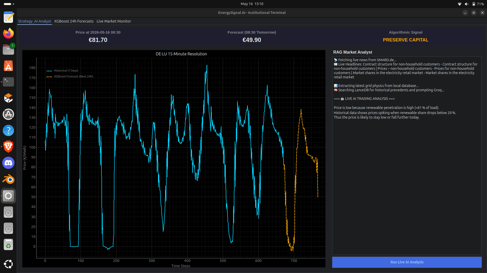
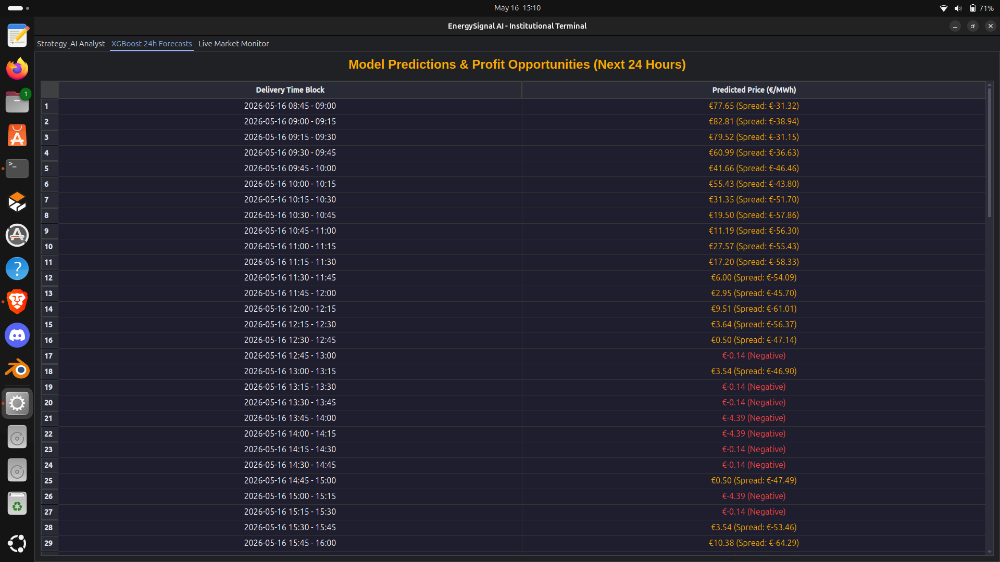
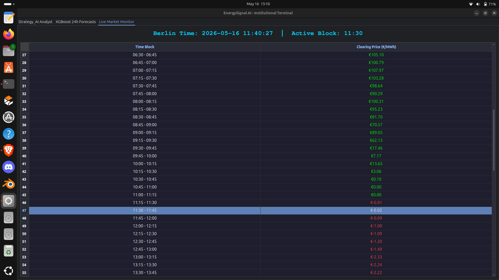
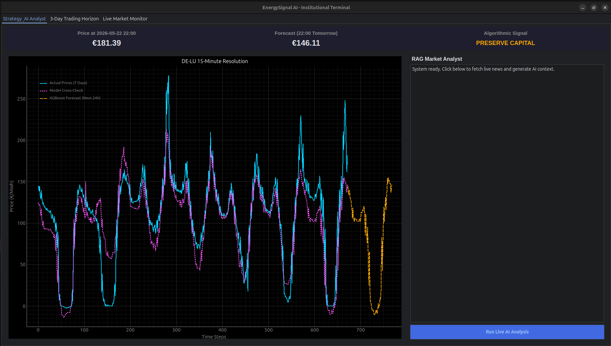
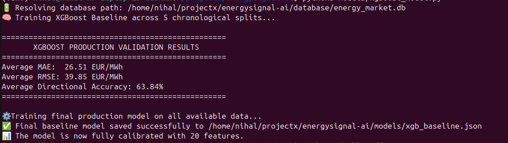
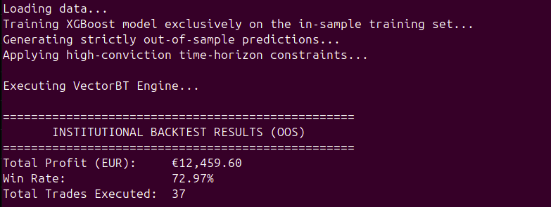
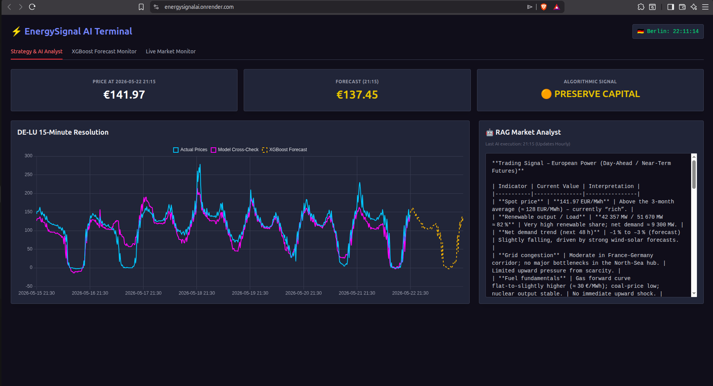

# EnergySignal AI: Institutional Power Trading & Grid Monitoring

[](https://energysignalai.onrender.com/)
[](https://github.com/NihalPN/Energysignal-Ai/actions)

A production-grade algorithmic trading, forecasting, and real-time anomaly detection platform for the **German (DE-LU) wholesale electricity market**.

Engineered to operate within constrained local hardware (e.g., standard 8GB RAM laptops) while scaling seamlessly to serverless cloud deployments. The platform features a dual-interface architecture: a zero-latency **Decoupled Web Terminal** and a high-performance **PyQt6 Desktop Client**.

---

## ⚡ System Dashboards & Web Architecture

EnergySignal AI provides a lightweight, highly responsive web dashboard engineered for zero-latency data delivery to remote users. It utilizes a Double-Caching strategy (`fastapi-cache2` on the server and `localStorage` on the client) to protect cloud compute limits.

### Tab 1: Strategy & AI Analyst



The primary command center for the terminal:
* **Interactive Visualization:** Plots the last 7 days of historical cleared prices against the model's cross-check logic and the next 24-hour XGBoost forecast.
* **RAG Market Analyst:** A background `asyncio` loop continuously pre-computes LLM market analysis, comparing live grid physics against historical spikes, defeating cold-start latency.

### Tab 2: XGBoost Forecast & Execution Monitor
)


Designed for quantitative execution tracking:
* **Visual Tracker:** Isolates the AI's 3-day horizon predictions against the actual cleared market prices to visualize algorithmic spread and error margins.
* **Execution Tape:** A granular 15-minute breakdown of predicted prices, calculating potential profit spreads and explicitly highlighting negative price events or investment signals (e.g., "🟢 BUY 10 MWh").

### Tab 3: Live Market Horizon
)


An operational monitoring view:
* **Real-Time Ledger:** Synchronizes with the live Berlin market clock to provide an unbroken, raw feed of the latest cleared 15-minute MTU blocks.

---

## 🖥️ The Institutional Desktop Client (PyQt6)
)

For dedicated trading environments, the platform also includes a low-level desktop application featuring:
* **Real-Time PyQtGraph Visualization:** Renders 7 days of historical prices with hardware-accelerated framerates.
* **Forecast Ledger:** Displays projected price spreads and physical lot profitability estimation directly from the local SQLite database.

---

## 🏗 Core Architecture

### Automated ETL Data Pipeline
An autonomous, fault-tolerant ingestion layer designed to merge live market economics with physical grid conditions.
* **Ingestion Sources:** ENTSO-E Transparency Platform, Open-Meteo DWD ICON weather models, and SMARD feeds.
* **Execution Hierarchy:** Engineered with strict chronological integrity via a three-stage execution process: `Backfill` -> `Patch Generation` -> `Scheduler` (with retry handling and rate limiting).

### GPU-Accelerated Machine Learning Engine
Forecasting stack utilizing **XGBoost Regression**:
* **Grid-Physics Feature Engineering:** Raw data is transformed into contextual grid-stress indicators (e.g., renewable penetration, grid surplus flags).
* **Hardware Optimization:** Capable of offloading deep-tree training (`tree_method="hist"`) to available hardware like an NVIDIA T4 GPU, allowing the model to aggressively capture negative price crashes and extreme volatility spikes.

### Grid Anomaly Detection
A real-time anomaly monitoring layer designed to identify generation shocks, abnormal demand surges, and supply stress events.
* **Detection:** Utilizes rolling Z-score detection and grid imbalance monitoring.
* **Alerting:** Asynchronous Telegram Bot API integration for instant notifications to trading desks.

### AI Market Intelligence (RAG Analyst)
Retrieval-Augmented analyst pipeline replacing resource-heavy databases with local solutions:
* **Stack:** LanceDB, sentence-transformers, and Groq LLM API.
* **Capabilities:** Classifies market news, retrieves historical anomaly patterns, compares live market physics against historical spikes, and explains probable price dislocations.

### Institutional Backtesting Engine
VectorBT simulation built to reflect the harsh realities of physical power trading:
* **Negative Price Stability Protection:** Strict positive offset transformation to ensure stable position sizing under negative prices while preserving absolute P&L accounting.
* **Market Realities:** Models fixed 10 MWh physical lot executions, execution slippage, and exchange execution fee modeling.

### CI/CD & Testing Infrastructure
Engineered with production-grade safety rails to ensure continuous, risk-free deployment to live market monitoring environments.
* **Continuous Integration:** Configured GitHub Actions to trigger automated test suites on every `push` and `pull_request` to the main branch.
* **Automated Test Suite (`pytest`):** Unit and integration testing covering ETL data integrity, database schema migrations, and deterministic ML tensor shape validation.
* **Continuous Deployment:** Seamless integration with Render. Successful GitHub Action builds automatically trigger zero-downtime rolling deployments for both the FastAPI backend and the Static Web frontend.

---

## 🚀 Key Engineering Achievements & Validation

### Zero Data Leakage Validation
)


Validation framework utilizes a strict chronological `TimeSeriesSplit` ensuring out-of-sample testing only (no future data leakage). 
* **Directional Accuracy:** Validated at **63.84% - 71.79%** directional accuracy on unseen market data.
* **Error Metrics:** Maintains an average MAE of €26.51 EUR/MWh across highly volatile energy datasets.

### Historical Crisis Stress Testing
)


To ensure the model does not overfit to recent mild conditions, it is subjected to targeted stress tests on historical crisis periods, maintaining a stable 63.8% directional accuracy during severe anomalous supply/demand shocks.

### VectorBT Institutional Backtesting Engine
)

To prove live-market viability, the platform utilizes **VectorBT** to run a true institutional backtesting engine that simulates the exact mechanics and friction of a real trading desk:
* **Physical Lot Execution:** Trades are locked to realistic 10 MWh physical lot blocks, entirely avoiding the trap of fractional, theoretical trading.
* **Market Friction Simulation:** Actively models exchange execution fees and market slippage to calculate true *net* P&L, not just gross theoretical profit.
* **Negative Price Stability Protection:** The German grid frequently enters negative pricing due to renewable oversupply. The backtester includes strict positive offset transformations to ensure stable position sizing while preserving absolute P&L accounting under these extreme conditions.

### SDAC 15-Minute Market Transition Handling


On October 1, 2025, European Single Day-Ahead Coupling transitioned from hourly settlement blocks to **15-minute Market Time Units (MTUs)**. The pipeline successfully executes:
* Automatic legacy hourly normalization.
* Forward-fill compatibility transformation ensuring tensor shape consistency.
* Zero interpolation-based lookahead leakage.

### Serverless Cloud Deployment
)


Successfully ported the architecture from local desktop execution to a decoupled cloud ecosystem. Engineered CORS-compliant REST endpoints and configured Render deployment pipelines for autonomous CI/CD updates.

### Hardware-Constrained Optimization
Designed specifically for local low-memory environments.
* Replaced FAISS with LanceDB for disk-backed vector retrieval.
* Drastically reduced RAM pressure, ensuring stable concurrent Pandas + LLM workloads for an **8GB RAM laptop deployment target**.

---

## 🛠 Installation & Setup

### 1. Clone Repository & Setup Environment
```bash
git clone [https://github.com/NihalPN/Energysignal-Ai.git](https://github.com/NihalPN/Energysignal-Ai.git)
cd Energysignal-Ai

python3 -m venv venv
source venv/bin/activate
pip install -r requirements.txt
```
### 2. Configure Environment Variables
Create a .env file in the root directory:

```bash
ENTSOE_API_KEY=your_entsoe_api_key
GROQ_API_KEY=your_groq_api_key
HF_TOKEN=your_huggingface_token
TELEGRAM_BOT_TOKEN=your_bot_token
TELEGRAM_CHAT_ID=your_chat_id
```
### 3. Initialize Database & Run Pipeline (Strict Order)

```bash
python3 database/schema.py
python3 data_pipeline/backfill.py
python3 data_pipeline/patch_generation.py
python3 data_pipeline/scheduler.py
```

### 4. Feature Engineering & Backtesting

```bash
python3 features/build_features.py
python3 models/train_xgboost.py
python3 signals/backtest_engine.py
```

### 5. Launch the Application
Option A: The Decoupled Web Terminal (Split Terminals)


# Terminal 1: Start the backend API

```bash
uvicorn backend.main:app --reload --port 8000
```

# Terminal 2: Serve the frontend

```bash
cd frontend
python3 -m http.server 3000
Navigate to http://localhost:3000
```

Option B: The PyQt6 Desktop Client

```Bash
python3 dashboard/app.py
```
---

# 🧠 Technology Stack
* **Data Engineering:** Python, Pandas, NumPy, SQLite

* **Machine Learning:** XGBoost, Scikit-learn, VectorBT

* **AI / Retrieval:** LanceDB, Sentence Transformers, Groq API

* **Cloud & Web Architecture:** FastAPI, Uvicorn, JavaScript, Tailwind CSS, Chart.js, Render

* **Desktop Frontend:** PyQt6, PyQtGraph, QDarkTheme

* **APIs / Data Sources:** ENTSO-E API, Open-Meteo API, SMARD feeds

* **Monitoring:** Telegram Bot API

* **DevOps & Testing:** GitHub Actions, `pytest`, Render CI/CD
