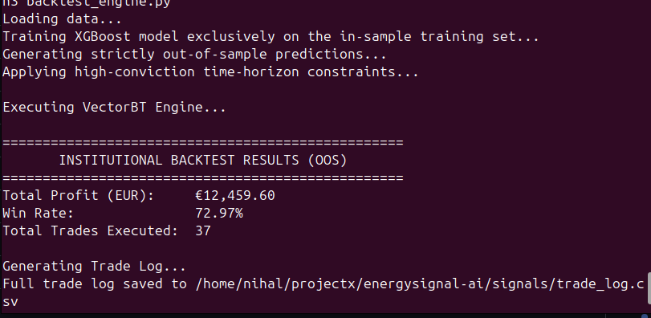

# EnergySignal AI: Institutional Power Trading & Grid Monitoring

A production-grade algorithmic trading, forecasting, and real-time anomaly detection platform for the **German (DE-LU) wholesale electricity market**.

Engineered to operate within constrained local hardware (**8GB RAM**) while handling the volatility and operational complexity of European electricity markets.

---

## 📸 System Architecture & Dashboard


### 1. Strategy & AI Analyst Terminal


Main PyQt6 institutional desktop interface featuring:

- real-time **PyQtGraph** market visualization
- last 7 days of historical market prices
- next 24-hour **XGBoost forecast**
- integrated **RAG analyst** using LanceDB + Groq LLM
- contextual explanation of market events such as renewable oversupply and load imbalance

---

### 2. Forecast Ledger


Forecast execution dashboard displaying:

- next **96 market intervals (15-minute MTUs)**
- projected price spreads
- opportunity filtering
- physical lot profitability estimation

---

### 3. Live Market Monitor


Operational monitoring terminal including:

- live Berlin market clock synchronization
- active 15-minute block identification
- local SQLite market retrieval
- real-time anomaly state monitoring

---

### 4. Backtesting Results


VectorBT backtesting output demonstrating:

- strict train/test separation
- realistic execution fee modeling
- physical lot simulation
- out-of-sample directional forecasting performance

---

# 🏗 Core Architecture

## Data Pipeline

Automated ingestion layer for:

- **ENTSO-E Transparency Platform**
- **Open-Meteo DWD ICON weather models**
- local SQLite persistence
- retry handling and rate limiting

Features:

- historical backfill support
- production patching workflows
- market data normalization
- weather-feature synchronization

---

## Machine Learning Forecasting Engine

Forecasting stack using:

- **XGBoost Regression**
- engineered market/weather features
- 15-minute resolution forecasting

Capabilities:

- next-day clearing price prediction
- directional movement estimation
- rolling retraining support

---

## Backtesting Engine

Institutional-style simulation built with **VectorBT**.

Features:

- fixed **10 MWh physical lot execution**
- slippage simulation
- exchange execution fee modeling
- chronological validation
- realistic position accounting

---

## Grid Anomaly Detection

Real-time anomaly monitoring layer.

Uses:

- rolling **Z-score detection**
- grid imbalance monitoring
- asynchronous Telegram alerts

Designed to identify:

- generation shocks
- abnormal demand surges
- supply stress events

---

## AI Market Intelligence (RAG Analyst)

Retrieval-Augmented analyst pipeline using:

- **LanceDB**
- sentence-transformers
- **Groq LLM API**

Capabilities:

- classify market news
- retrieve historical anomaly patterns
- compare live market physics against historical spikes
- explain probable price dislocations

---

# 🚀 Key Engineering Achievements

## SDAC 15-Minute Market Transition Handling

On **October 1, 2025**, European Single Day-Ahead Coupling transitioned from hourly settlement blocks to **15-minute Market Time Units (MTUs).**

Pipeline handling includes:

- automatic legacy hourly normalization
- forward-fill compatibility transformation
- tensor shape consistency
- no interpolation-based lookahead leakage

---

## Negative Price Stability Protection

German wholesale power markets frequently enter negative pricing due to renewable oversupply.

Backtester safeguards include:

- strict positive offset transformation
- stable position sizing under negative prices
- preserved absolute P&L accounting

---

## Zero Data Leakage Validation

Validation framework includes:

- strict chronological **TimeSeriesSplit**
- out-of-sample testing only
- no future data leakage

Performance:

- **71.79% directional accuracy**
- validated on unseen market data

---

## Hardware-Constrained Optimization

Designed specifically for local low-memory environments.

Optimization decisions:

- replaced **FAISS** with **LanceDB**
- disk-backed vector retrieval
- reduced RAM pressure
- stable concurrent Pandas + LLM workloads

Target environment:

**8GB RAM laptop deployment**

---

# 🛠 Installation & Setup

## 1. Clone Repository

```bash
git clone https://github.com/NihalPN/Energysignal-Ai.git
cd Energysignal-Ai
```

---

## 2. Create Virtual Environment

```bash
python3 -m venv venv
source venv/bin/activate
```

Install dependencies:

```bash
pip install -r requirements.txt
```

---

## 3. Configure Environment Variables

Create `.env`:

```env
ENTSOE_API_KEY=your_entsoe_api_key
GROQ_API_KEY=your_groq_api_key
TELEGRAM_BOT_TOKEN=your_bot_token
TELEGRAM_CHAT_ID=your_chat_id
```

---

## 4. Initialize Database

```bash
python3 database/schema.py
```

---

## 5. Historical Data Backfill

Download market/weather history:

```bash
python3 data_pipeline/backfill.py
python3 data_pipeline/patch_generation.py
```

---

## 6. Feature Engineering

```bash
python3 features/build_features.py
```

---

## 7. Backtest Strategy

```bash
python3 signals/backtest_engine.py
```

---

## 8. Launch Desktop Terminal

```bash
python3 dashboard/app.py
```

---

# 🧠 Technology Stack

## Data Engineering

- Python
- Pandas
- NumPy
- SQLite

## Machine Learning

- XGBoost
- Scikit-learn
- VectorBT

## AI / Retrieval

- LanceDB
- Sentence Transformers
- Groq API

## APIs / Data Sources

- ENTSO-E API
- Open-Meteo API
- SMARD feeds

## Monitoring

- Telegram Bot API

## Frontend

- PyQt6
- PyQtGraph
- QDarkTheme

---

# Design Principles

This project emphasizes:

- modular architecture
- realistic market simulation
- anti-leakage validation
- hardware efficiency
- production-style observability
- explainable AI-assisted market intelligence
