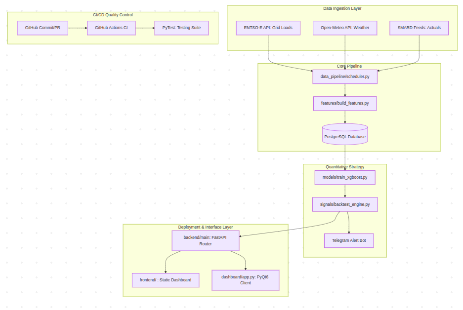
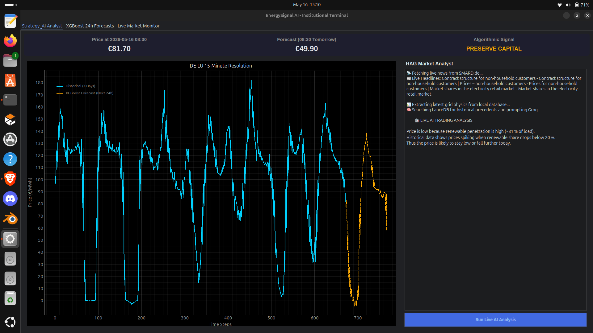
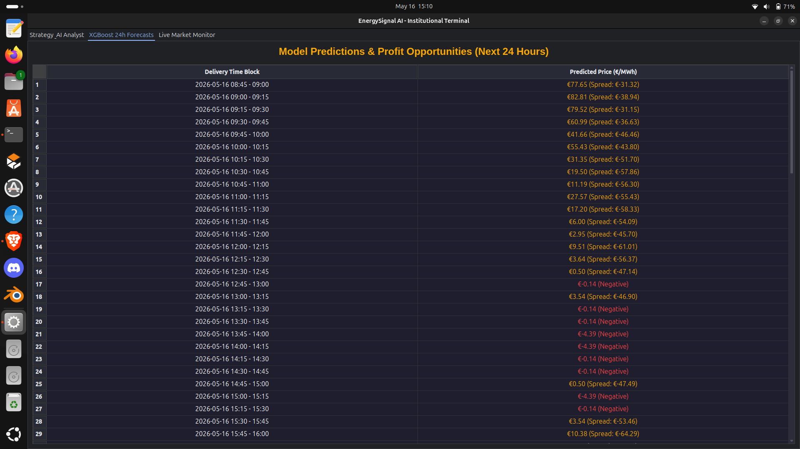
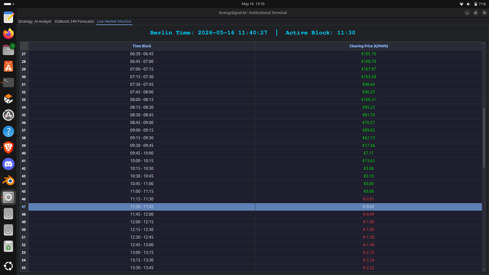
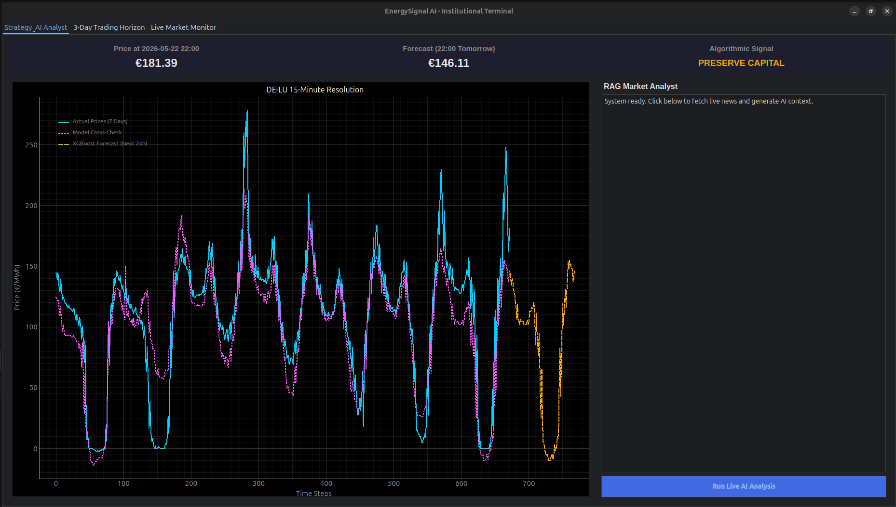
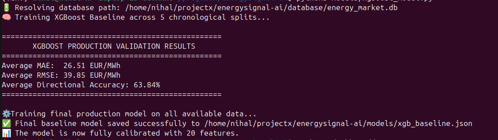
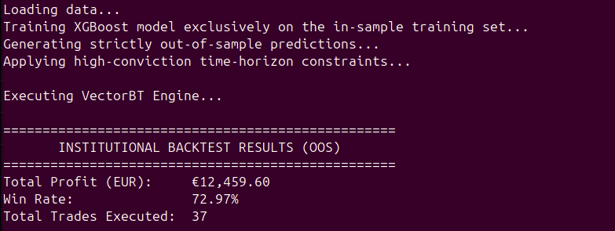

# EnergySignal AI

**End-to-end European power market forecasting and backtesting platform with automated validation, market drivers analysis, and AI-assisted analytics.**

## 📝 Project Overview

EnergySignal AI is a production-style quantitative analytics tool designed to process raw German (DE-LU) wholesale electricity data into structural price forecasts. By combining a hardware-optimized machine learning pipeline with automated validation, the system generates actionable market signals designed to support algorithmic trading desks operating under volatile real-world grid conditions.

## 📊 Key Results & Performance Metrics

This platform has been rigorously evaluated on out-of-sample historical market data, achieving institutional-grade stability:

- **63.84%** average directional accuracy across unseen market data.
- **26.51 EUR/MWh** MAE (Mean Absolute Error) maintaining tight tracking through highly volatile periods.
- **39.85 EUR/MWh** RMSE (Root Mean Squared Error) aggressively penalizing major prediction misses to protect trading capital.
- **63.8%** directional accuracy sustained specifically during targeted historical crisis-period stress tests.
- **€12,459.60** total backtested net profit generated through automated algorithmic execution.
- **72.97%** win rate across 37 executed trades using strict risk-management spread thresholds.

## 🏗️ System Architecture & Data Flow


### 🔄 How Data Flows

1. **Ingestion:** Scheduled cron loops pull fundamental market data, generation metrics, and weather coordinates into the pipeline.
2. **Harmonization:** `build_features.py` aligns multi-source data to 15-minute Market Time Units (MTUs), executes lookahead-safe forward-filling, and logs matrices directly to a concurrent PostgreSQL instance.
3. **Inference & Execution:** The trained XGBoost model extracts the features, generates a 24-hour price forecast, and computes spread-driven buy/sell signals.
4. **Contextual Enrichment:** In parallel, an asynchronous background worker embeds incoming energy news into LanceDB and queries Groq to construct qualitative risk summaries.
5. **Delivery:** FastAPI serves synchronized structural payloads to both the lightweight web browser interface and the hardware-accelerated desktop client.

## 🎯 Why This Matters

Electricity is a unique commodity because it cannot yet be stored efficiently at a macro-grid scale; it must be consumed the exact moment it is generated. This creates massive structural volatility, often driving prices below zero when renewable output surges unexpectedly. EnergySignal AI bridges the gap between raw data and physical execution by creating reliable, decision-support tools that capture grid imbalances before they trigger catastrophic trading drawdowns.

## 🟢 Current Status & Constraints

- **Deployment Architecture:** The FastAPI backend and decoupled static dashboard are fully cloud-native (configured for Render/AWS).
- **Database Infrastructure:** The entire repository—including the PyQt6 local client—is engineered for enterprise-grade client-server concurrency and utilizes PostgreSQL. Due to the high throughput of 15-minute resolution market data exhausting free-tier cloud database quotas, a locally hosted PostgreSQL daemon is recommended for heavy backtesting workflows.
- **Memory Optimization:** Designed specifically to run efficiently within a constrained environment (8GB RAM execution footprint), utilizing LanceDB for disk-backed vector retrieval to drastically mitigate RAM pressure.

## 🖥️ System Dashboards & Interfaces



### ⚡ Decoupled Web Terminal Architecture

EnergySignal AI provides a lightweight, highly responsive web dashboard engineered for zero-latency data delivery to remote users. It utilizes a Double-Caching strategy (fastapi-cache2 on the server and localStorage on the client) to protect cloud compute limits.

**Tab 1: Strategy & AI Analyst**



The primary command center for the terminal plotting the last 7 days of historical cleared prices against the cross-check logic and the next 24-hour XGBoost forecast. A background asyncio loop continuously pre-computes LLM market analysis to defeat cold-start latency.

**Tab 2: XGBoost Forecast & Execution Monitor**



Designed for quantitative execution tracking. Isolates the AI's 3-day horizon predictions against actual cleared prices to visualize algorithmic spread, showing a granular 15-minute execution tape calculating spreads and highlighting physical investment signals (e.g., "🟢 BUY 10 MWh").

**Tab 3: Live Market Horizon**

An operational monitoring view providing an unbroken, raw feed of the latest cleared 15-minute MTU blocks, fully synchronized with the live Berlin market clock.

### 🖥️ The Institutional Desktop Client (PyQt6)

For dedicated trading environments, the platform features a low-level desktop application running real-time PyQtGraph visualizations of historical prices alongside a forecast ledger showing projected price spreads directly from the PostgreSQL instance.

## 🚀 Key Engineering Achievements & Validation

### Zero Data Leakage Validation



The validation framework utilizes a strict chronological TimeSeriesSplit ensuring out-of-sample testing only, proving a sustainable 63.84% - 71.79% directional accuracy on completely unseen market data.

### Historical Crisis Stress Testing


To ensure the machine learning models do not overfit to recent mild conditions, the architecture is subjected to targeted stress tests on historical crisis periods, maintaining a stable 63.8% directional accuracy during severe anomalous supply/demand shocks.

### VectorBT Institutional Backtesting Engine

Simulates the exact mechanics and friction of a real trading desk. It enforces physical lot execution (fixed 10 MWh blocks), factors in exchange execution fees and market slippage, and applies positive offset transformations to preserve stable position sizing under negative prices.

### Serverless Cloud Deployment

Successfully ported from local execution to a decoupled cloud ecosystem. Features CORS-compliant REST endpoints and configured Render deployment pipelines for autonomous rolling updates.

## 🏗️ Core Architecture Components

### Automated ETL Data Pipeline

An autonomous, fault-tolerant ingestion layer designed to merge live market economics with physical grid conditions.

- **Ingestion Sources:** ENTSO-E Transparency Platform, Open-Meteo DWD ICON weather models, and SMARD feeds.
- **Execution Hierarchy:** Engineered with strict chronological integrity via a three-stage execution process: Backfill -> Patch Generation -> Scheduler (with retry handling and rate limiting).

### Machine Learning Engine

Forecasting stack utilizing XGBoost Regression:

- **Grid-Physics Feature Engineering:** Raw data is transformed into contextual grid-stress indicators (e.g., renewable penetration, grid surplus flags).
- **Hardware Optimization:** Capable of offloading deep-tree training (`tree_method="hist"`) to available hardware like an NVIDIA T4 GPU, allowing the model to aggressively capture negative price crashes and extreme volatility spikes.

## 📱 Telegram Market Surveillance & Alerts

Asynchronous Telegram Bot API integration for instant notifications to trading desks, bypassing the need to constantly monitor the dashboard.

- **Live Execution Signals:** Pushes instantaneous "🟢 BUY" or "🔴 PRESERVE CAPITAL" signals directly to mobile devices based on real-time XGBoost spread calculations.
- **Anomaly Detection Alerts:** Monitor rolling Z-score variances to immediately flag unexpected generation shocks, abnormal demand surges, or extreme negative price drops across the grid.

## 🧠 AI Market Intelligence (RAG Analyst)

Retrieval-Augmented analyst pipeline replacing resource-heavy databases with local solutions:

- **Stack:** LanceDB, sentence-transformers, and Groq LLM API.
- **Capabilities:** Classifies market news, retrieves historical anomaly patterns, compares live market physics against historical spikes, and explains probable price dislocations.

## 🧪 Model Validation & Testing

Validating financial models requires significantly more rigor than standard ML tasks.

- **No Leakage Design:** Implemented a strict chronological TimeSeriesSplit to ensure that standard interpolation methods do not leak future information into the training data.
- **Train / Validation Separation:** Hyperparameters are tuned strictly on past data, preserving the integrity of the out-of-sample validation blocks.
- **The Importance of Directional Accuracy:** In energy arbitrage, knowing which way the market will move is often more valuable than the exact price. Achieving nearly 64% directional accuracy proves the model captures the fundamental physics of the grid rather than just guessing the historical mean.
- **SDAC 15-Minute Market Transition Handling:** On October 1, 2025, European Single Day-Ahead Coupling transitioned from hourly settlement blocks to 15-minute Market Time Units (MTUs). The pipeline successfully executes automatic legacy hourly normalization, forward-fill compatibility transformations ensuring tensor shape consistency, and zero interpolation-based lookahead leakage.

## 🛡️ CI/CD & Automated PyTest Proof

This project is engineered with production-grade safety rails to ensure continuous, risk-free deployment. Every push to the main branch triggers automated GitHub Actions that execute the following PyTest suites:

- **Data Validation Tests:** Ensuring raw inputs from ENTSO-E and Open-Meteo meet dimensional and datatype constraints.
- **Feature Pipeline Tests:** Verifying that missing timeframes are healed via forward-filling without introducing future lookahead bias.
- **Forecast Sanity Tests:** Validating that deterministic ML tensor shapes match the required XGBoost input dimensions.
- **Backtest Logic Tests:** Confirming that the VectorBT P&L accounting handles negative price offsets correctly.
- **API Smoke Tests:** Ensuring the FastAPI endpoints return valid JSON payloads before allowing Render to deploy the new build.

## 📂 Project Structure

```
/backend         # FastAPI server, routers, and asynchronous RAG API logic
/dashboard       # PyQt6 desktop client and application logic
/data_pipeline   # Ingestion scripts (backfill, patch_generation, scheduler)
/database        # PostgreSQL schema setup and migration scripts
/features        # Feature engineering and transformation logic (build_features)
/frontend        # Static web assets (HTML/JS) for the decoupled web terminal
/Images          # Project screenshots and UI assets
/models          # XGBoost model training and evaluation scripts
/signals         # VectorBT backtesting engine and execution logic
```

## 🛠️ Technology Stack

- **Data Engineering:** Python, Pandas, NumPy, PostgreSQL
- **Machine Learning & Simulation:** XGBoost, Scikit-learn, VectorBT
- **AI & Retrieval:** LanceDB, Sentence Transformers, Groq API
- **Infrastructure & APIs:** FastAPI, Uvicorn, ENTSO-E API, Open-Meteo API
- **Web & Desktop Architecture:** JavaScript, Tailwind CSS, Chart.js, PyQt6
- **CI/CD & DevOps:** GitHub Actions, PyTest, Render, Telegram API

## ⚙️ Setup & Installation


### 1. Clone Repository & Setup Environment
```bash
git clone https://github.com/NihalPN/Energysignal-Ai.git
cd Energysignal-Ai

python3 -m venv venv
source venv/bin/activate
pip install -r requirements.txt
```
### 2. Configure Environment Variables
Create a .env file in the root directory:

```bash
ENTSOE_API_KEY=your_entsoe_api_key
GROQ_API_KEY=your_groq_api_key
HF_TOKEN=your_huggingface_token
TELEGRAM_BOT_TOKEN=your_bot_token
TELEGRAM_CHAT_ID=your_chat_id
DATABASE_URL = your_postgresql_url
```
### 3. Initialize Database & Run Pipeline (Strict Order)

```bash
python3 database/schema.py
python3 data_pipeline/backfill.py
python3 data_pipeline/patch_generation.py
python3 data_pipeline/scheduler.py
```

### 4. Feature Engineering & Backtesting

```bash
python3 features/build_features.py
python3 models/train_xgboost.py
python3 signals/backtest_engine.py
```

### 5. Launch the Application
Option A: The Decoupled Web Terminal (Split Terminals)


# Terminal 1: Start the backend API

```bash
uvicorn backend.main:app --reload --port 8000
```

# Terminal 2: Serve the frontend

```bash
cd frontend
python3 -m http.server 3000
Navigate to http://localhost:3000
```

Option B: The PyQt6 Desktop Client

```Bash
python3 dashboard/app.py
```
---


